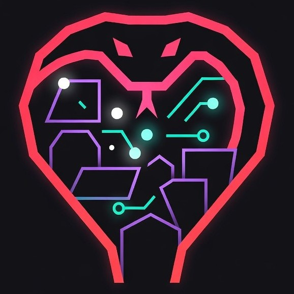

# Entropic Chaos

<div align="center">
  
  
  **Distributed Post-Quantum Entropy Generation Network**
  
  *NIST SP 800-90B Audit-Before-Wrap Architecture*
</div>

---

**Entropic Chaos** is a production-quality distributed entropy generation network across the CHIRASU (my homelab) mesh. This project showcases rigorous entropy validation through NIST SP 800-90B auditing *before* Post-Quantum Cryptography key wrapping, positioning it as a credible demonstration of next-generation cryptographic systems.

The network features personality-driven interaction through three character nodes:
- **Cipher-tan** (ESP32-S3): Entropy harvester with TRNG, WiFi noise, and USB jitter collection
- **Echo-tan** (ESP32-S3): Dedicated NIST SP 800-90B audit validator 
- **Ayatoki** (Dell OptiPlex/Fedora): Orchestrator node coordinating the distributed system

**Current Status:** Phase 1 Complete - MVP operational with Cipher-tan, Ayatoki orchestrator, and PQC integration.

## Features

### Core Architecture
- **Audit-Before-Wrap Principle**: Entropy validated by dedicated hardware (Echo-tan) before PQC wrapping
- **Distributed Harvesting**: Multi-node entropy generation across CHIRASU network
- **Immutable Audit Trails**: Hardware heartbeat verification and persistent logging
- **HKDF Key Derivation**: Proper context labeling prevents key reuse across distributed nodes
- **Production-Quality**: Built to NIST credibility standards, not just proof-of-concept

### Phase 1: Cobra Lab MVP (✅ COMPLETE)
- **Ayatoki Orchestrator**: Dell OptiPlex running Fedora with PySide6 GUI
- **Cipher-tan ESP32-S3**: Primary entropy harvester with TRNG, WiFi jitter, USB timing
- **PQC Integration**: Kyber512 KEM and Falcon512 signatures with Rust bindings
- **Discord Integration**: Cipher-bot presence monitoring and status reporting
- **Real-time Visualization**: Live entropy quality assessment and key generation monitoring

### Entropy Sources
- **Keystroke Timing**: Sub-microsecond timing precision from keyboard events
- **Mouse Movement**: Micro-movements contribute to entropy pool
- **ESP32 TRNG**: Hardware true random number generator
- **USB Jitter**: Inter-arrival timing entropy from USB communications
- **WiFi Entropy**: Environmental RF noise collection (Phase 2+)
- **Host RNG**: OS-level /dev/urandom integration

### GUI Features (Ayatoki Node)
- **Modern Interface**: PySide6-based with Cobra Lab aesthetic (black/red/purple theme)
- **Multi-Source Display**: Real-time tracking of all entropy contributors
- **Audit Dashboard**: Live NIST SP 800-90B compliance monitoring
- **Network Status**: Headscale/mesh connectivity visualization
- **Tray Integration**: Background operation with system tray
- **Configurable Settings**: Brightness, timing windows, PQC algorithms
- **Key Logging**: JSON-based storage with comprehensive metadata

### ESP32-S3 Firmware (Cipher-tan v2.1 Enhanced)
- **TRNG Streaming**: Configurable 1-50Hz true random number generation
- **WiFi Entropy Buffer**: 256-byte environmental RF noise collection
- **USB Jitter Buffer**: 256-byte timing entropy from USB communications  
- **RGB Control**: Dynamic LED feedback with 16M+ colors via WS2812
- **Personality System**: Cipher-tan's cryptographic commentary
- **Status Monitoring**: Real-time hardware telemetry (JSON over serial)
- **Persistent Config**: Flash-stored settings survive reboots
- **Emergency Fallback**: Graceful degradation on hardware failures

## Development Phases

### Phase 1: Cobra Lab MVP ✅ **COMPLETE**
**Goal:** Ayatoki + Cipher-tan → Entropic Chaos GUI with PQC support

**Achievements:**
- ✅ Ayatoki orchestrator running Fedora with full GUI
- ✅ Cipher-tan ESP32-S3 responding with enhanced v2.1 firmware
- ✅ TRNG streaming at configurable rates (1-50Hz)
- ✅ PQC bindings (Kyber512 + Falcon512) built and functional
- ✅ GUI rebranded to "Entropic Chaos / Cobra Lab"
- ✅ Cipher-bot Discord presence monitoring
- ✅ Real-time entropy visualization and audit scoring

**Deliverables:**
- Working GUI with Cipher entropy integration
- PQC key wrapping operational
- Discord bot online for status reporting
- Key logging with comprehensive metadata

### Phase 2: Echo Dual Auditor 🚧 **NEXT UP**
**Goal:** Echo as dedicated NIST auditor + secondary entropy harvester

**Planned Features:**
- Echo-tan ESP32-S3 firmware (derived from Cipher's)
- **Pre-wrap audit**: Ayatoki validates entropy before PQC operations
- **Post-wrap audit**: Echo independently verifies output integrity
- Per-key JSON logging for audit trail persistence
- Echo-bot Discord integration with audit verdicts
- `/prewrap_audit` and `/postwrap_audit` Discord commands

**Success Criteria:**
- Every key has dual audit records (Ayatoki + Echo)
- Echo's firmware mirrors Cipher's capabilities
- Discord bots show coordinated status

### Phase 3: Mitsu Network Harvester 📋 **PLANNED**
**Goal:** Add Mitsu laptop as remote entropy contributor

**Architecture:**
- Small Python daemon on Mitsu-chan (systemd service)
- Entropy frames sent over Tailscale network
- **Guardrails**: Only accept frames when Mitsu idle or running specific tasks
- Sensor inputs: CPU temp, load jitter, I/O timing, network ping variance
- Rate limiting to prevent "steady bit" contamination

**Deliverables:**
- Mitsu entropy frames merged into Ayatoki pool
- Audit system flags suspicious steady-state contributions
- System operates normally with Mitsu offline (graceful degradation)

### Phase 4: Dynamic Class System 📋 **PLANNED**
**Goal:** Nodes dynamically shift roles based on system state

**Class Definitions:**
- `harvester` - Gather entropy (Cipher, Echo, Mitsu)
- `auditor` - Run NIST compliance checks (Ayatoki, Echo, Mitsu)
- `validator` - Final yes/no on key usability
- `wrapper` - Perform PQC operations (Ayatoki, Mitsu)

**Orchestration:**
- Lab orchestrator script polls node state (idle time, load, battery)
- Applies rules to assign classes dynamically
- Example: "Mitsu idle >5min on AC → assign [harvester, auditor]"
- Roles can overlap (e.g., Ayatoki = auditor + wrapper simultaneously)

**Deliverables:**
- Dashboard showing live role assignments
- Entropy pipeline adapts to which nodes are busy vs. idle
- Multi-class assignment per node

### Phase 5: Blockchain Ledger Integration 📋 **PLANNED**
**Goal:** Anchor all key events in GorÅ + Kasumi's blockchain

**Event Structure:**
```json
{
  "event_type": "entropy_key_issued",
  "key_id": "kyber512_wrapped_abc123...",
  "entropy_sources": ["cipher", "echo", "mitsu"],
  "prewrap_audit": {"score": 78.2, "entropy_bpb": 7.1},
  "postwrap_audit": {"score": 80.5, "entropy_bpb": 7.0},
  "pqc": {"kem": "Kyber512", "sig": "Falcon512"},
  "role_assignments": {...},
  "falcon_signature": "..."
}
```

**Workflow:**
1. Ayatoki generates key with full audit trail
2. Echo signs off on post-wrap verification
3. Event serialized and signed with Falcon512
4. Sent to GorÅ/Kasumi blockchain RPC endpoint
5. Query key provenance via `/get_event key_id`

**Deliverables:**
- Every key has immutable ledger record
- Signature verification proves authenticity
- Provenance reconstruction from blockchain
- Demo mode: "Pick a key, see its full history"

## Setup

### Prerequisites

**Ayatoki Orchestrator (Primary Host):**
```bash
# Fedora Linux (or similar) recommended
# Python 3.8+ required

# Install system dependencies
sudo dnf install python3-pip python3-virtualenv gcc rust cargo

# For PQC support, ensure Rust toolchain is available
# https://rustup.rs/ - or use: curl --proto '=https' --tlsv1.2 -sSf https://sh.rustup.rs | sh
```

**Cipher-tan ESP32-S3:**
- ESP32-S3 development board with accessible GPIO pins
- MicroPython firmware installed
- USB connection to Ayatoki for serial communication

**Optional (Phase 2+):**
- Echo-tan ESP32-S3 for dedicated auditing
- Mitsu laptop for network entropy contribution
- Headscale/Tailscale for mesh networking

### Hardware Setup

**Cipher-tan ESP32-S3 Board:**
1. **Board Selection**: Any ESP32-S3 with accessible GPIO pins (tested: ESP32-S3-DevKitC-1)
2. **LED Configuration**: 
   - **Primary**: WS2812 addressable LED on GPIO48 (auto-detected)
   - **Fallback**: Tries GPIO 8, 38, 48, 47, 21, 2 if primary fails
   - **Manual RGB**: GPIO47 (R), GPIO21 (G), GPIO14 (B) if WS2812 unavailable
3. **USB Connection**: Serial communication at 115200 baud (USB CDC)
4. **Power**: 5V via USB (powers board + LED)

**Ayatoki Orchestrator:**
- Dell OptiPlex or similar x86_64 system
- Fedora Linux (or Ubuntu/Debian)
- Available USB port for Cipher-tan connection
- Optional: udev rule for persistent `/dev/ttyCIPHER` symlink

**Network (Optional - Phase 3+):**
- Headscale server or Tailscale account for CHIRASU mesh
- Network connectivity for all nodes

### Software Installation (Ayatoki Orchestrator)

1. **Clone the repository**:
   ```bash
   cd ~  # Or your preferred location
   git clone https://github.com/JupitersGhost/CipherChaos.git
   cd CipherChaos
   ```

2. **Create and activate virtual environment** (strongly recommended):
   ```bash
   # Create virtual environment
   python3 -m venv venv
   
   # Activate virtual environment
   source venv/bin/activate
   
   # Verify activation (should show venv path)
   which python
   ```

3. **Install Python dependencies**:
   ```bash
   pip install -r requirements.txt
   ```

4. **Build PQC bindings** (required for Kyber512/Falcon512):
   ```bash
   # Ensure Rust toolchain is installed first
   # If not: curl --proto '=https' --tlsv1.2 -sSf https://sh.rustup.rs | sh
   
   # Install maturin (Rust-to-Python build tool)
   pip install maturin==1.6.0
   
   # Build and install the PQC bindings
   maturin develop --release
   
   # Verify installation
   python -c "import pqcrypto_bindings; print('PQC bindings available')"
   ```

5. **Flash Cipher-tan ESP32-S3 firmware**:
   ```bash
   # Prerequisites:
   # - MicroPython installed on ESP32-S3
   # - Recommended tool: Thonny IDE for easy file transfer
   
   # Copy main.py to your ESP32-S3 board as the boot script
   # The firmware will auto-start on power-up
   ```

6. **Optional: Create udev rule for persistent device name** (Linux):
   ```bash
   # Find your ESP32 vendor/product IDs
   lsusb | grep -i esp
   
   # Create udev rule (adjust IDs as needed)
   echo 'SUBSYSTEM=="tty", ATTRS{idVendor}=="303a", ATTRS{idProduct}=="1001", SYMLINK+="ttyCIPHER"' | \
     sudo tee /etc/udev/rules.d/99-cipher.rules
   
   # Reload udev rules
   sudo udevadm control --reload-rules
   sudo udevadm trigger
   ```

7. **Run Entropic Chaos GUI**:
   ```bash
   # Make sure virtual environment is activated
   source venv/bin/activate
   
   # Launch the GUI
   python cipherchaoslive.py
   ```

### Discord Bot Setup (Optional - Phase 1)

1. **Create Discord bot** at https://discord.com/developers/applications
2. **Get bot token** and invite bot to your server
3. **Configure environment**:
   ```bash
   # Create .env file in project root
   cp .env.example .env  # If example exists, or create new
   
   # Edit .env and add:
   DISCORD_TOKEN=your_bot_token_here
   CIPHER_PORT=/dev/ttyCIPHER  # Or COM port on Windows
   CIPHER_BAUD=115200
   CIPHER_STATUS_ONLINE_MINUTES=20
   CIPHER_STATUS_OFFLINE_MINUTES=30
   ```

4. **Run Cipher-bot**:
   ```bash
   # Install discord.py if not in requirements.txt
   pip install discord.py python-dotenv pyserial
   
   # Run bot
   python cipher-bot.py
   
   # Or as systemd service (recommended for production)
   sudo cp cipher-bot.service /etc/systemd/system/
   sudo systemctl daemon-reload
   sudo systemctl enable cipher-bot
   sudo systemctl start cipher-bot
   ```

## ESP32-S3 Firmware (Cipher-tan v2.1 Enhanced)

### Flashing the Firmware
1. **Install MicroPython** on your ESP32-S3:
   - Download latest stable MicroPython for ESP32-S3
   - Flash using esptool: `esptool.py --chip esp32s3 write_flash -z 0x0 micropython.bin`
   - Or use Thonny IDE's built-in flasher

2. **Copy firmware to board**:
   - Open Thonny IDE and connect to ESP32-S3
   - Copy `main.py` from project to board as `main.py`
   - Firmware auto-starts on boot

3. **Verify installation**:
   - Connect via serial terminal (115200 baud)
   - Send `VER?` command
   - Should respond with: `cipher-tan Enhanced v2.1-Fixed-Complete`

### Firmware Commands

**Basic Control:**
- `VER?` - Get firmware version and configuration
- `STAT?` - Get detailed JSON status (includes WiFi/USB entropy metrics)
- `TEST?` - Run comprehensive system diagnostics
- `RESET` - Restart the ESP32 device

**RGB LED Control:**
- `RGB:r,g,b` - Set LED color (0-255 each component)
  - Example: `RGB:255,0,128` - Hot pink
- `BRI:0.5` - Set brightness (0.01-1.0 range)
  - Example: `BRI:0.3` - 30% brightness
- `PIN:48` - Change LED pin assignment (0-48)

**TRNG Streaming:**
- `TRNG:START,10` - Start TRNG streaming at 10Hz (1-50Hz range)
  - Returns base64-encoded entropy chunks
  - Format: `TRNG:<base64_data>`
- `TRNG:STOP` - Stop TRNG streaming

**Configuration:**
- `DEBUG:on` - Enable debug logging mode
- `DEBUG:off` - Disable debug logging
- `PERSONALITY:0.7` - Set quip frequency (0.0-1.0)
  - 0.0 = silent, 1.0 = maximum sass

**Key Operations:**
- `RND?` - Request 32 bytes of TRNG data (hex-encoded)
- `POOL:<hex>` - Forge key from entropy pool
  - Responds with `KEY:<hex>` containing derived key

### Status Response Format

The `STAT?` command returns JSON with:
```json
{
  "version": "cipher-tan Enhanced v2.1-Fixed-Complete",
  "uptime_ms": 12345678,
  "commands": 42,
  "keys_forged": 5,
  "rgb_updates": 127,
  "memory_free": 187432,
  "errors": 0,
  "led_pin": 48,
  "led_type": "ws2812",
  "brightness": 1.0,
  "wifi_entropy_bytes": 128,
  "usb_entropy_bytes": 256,
  "wifi_last_scan_ms": 5000,
  "wifi_ap_count": 3,
  "wifi_joined": false
}
```

### Cipher-tan Personality

The firmware features Cipher-tan's personality quips based on configured `personality_level`:

**Startup:**
- "*** cipher-tan online! Ready to wreak cryptographic havoc!"
- ">>> Boot complete! Time to turn silicon into pure randomness!"

**RGB Updates:**
- "*** Pretty colors! My LED is definitely more stylish!"
- "~~~ RGB storm engaged! Each photon carries chaos~"

**Key Forging:**
- "[*] Key forged in the fires of chaos!"
- "\\o/ My key-crafting skills are legendary!"

**Errors (even chaos queens recover):**
- "^_^ Oops! Even chaos queens make mistakes sometimes..."
- "\\m/ Error handled like a boss! cipher-tan recovers!"

## Configuration

### GUI Configuration (Ayatoki Orchestrator)

**Entropy Collection:**
- **Window Duration**: 0.2-30.0 seconds for entropy pool accumulation
- **Keystroke Capture**: Automatically enabled when system active
- **Mouse Entropy**: Micro-movement tracking (toggle in Chaos Control panel)
- **Host RNG**: `/dev/urandom` or OS CSPRNG contribution (recommended: enabled)
- **ESP32 TRNG**: Hardware entropy from Cipher-tan (recommended: enabled)

**LED Control:**
- **Brightness**: 1-100% brightness control (sent to ESP32)
- **RGB Chaos Mode**: Auto-updating colors based on entropy events
- **Lights Toggle**: Enable/disable RGB feedback entirely

**PQC Settings:**
- **Enable PQC**: Master toggle for post-quantum key wrapping
- **Kyber512 KEM**: Key encapsulation mechanism (recommended)
- **Falcon512 Signatures**: Digital signature verification
- **Auto-save Keys**: Automatically persist wrapped keys to `keys/` directory
- **Audit Threshold**: Minimum entropy score for PQC (default: 65.0%, 6.0 bits/byte)

**Logging:**
- **Key Log Path**: Default: `~/Desktop/CobraLab_EntropicChaos/logs/cipherchaos_session_<pid>.txt`
- **Log Format**: JSON entries with timestamps, metadata, and audit results
- **Session Logs**: Separate file per GUI session for audit trails

### ESP32 Configuration (Cipher-tan)

The firmware stores configuration in **flash memory** at `cipher_enhanced_cfg.json`:

```json
{
  "led_pin": 48,
  "brightness": 1.0,
  "personality_level": 0.3,
  "debug_mode": false,
  "led_type": "ws2812",
  "rgb_pins": [47, 21, 14]
}
```

**Settings persist across reboots** and can be updated via serial commands.

### Hardware Pin Configuration

**Cipher-tan ESP32-S3:**
- **Default WS2812 LED**: GPIO48 (auto-detected, falls back to GPIO 8, 38, 47, 21, 2)
- **Fallback RGB Pins**: GPIO47 (R), GPIO21 (G), GPIO14 (B)
- **Serial**: USB CDC at 115200 baud (no additional pins needed)

**Pin Selection Strategy:**
1. Try configured pin first
2. If WS2812 init fails, try common fallback pins
3. If all WS2812 attempts fail, switch to individual RGB mode
4. Emergency mode: No LEDs, continue operation

### Network Configuration (Phase 3+)

**Headscale/Tailscale:**
- Detected automatically via process monitoring
- Shows "Mesh Peers" count when connected
- Standalone operation when disconnected

**Mitsu Network Entropy:**
- Entropy frames sent via HTTPS POST to Ayatoki
- TLS encryption over Tailscale tunnel
- Rate limiting: Max N frames/second configurable

### Discord Bot Configuration

**Environment variables** in `.env` file:

```bash
DISCORD_TOKEN=your_bot_token_here
CIPHER_PORT=/dev/ttyCIPHER  # Or COM port on Windows
CIPHER_BAUD=115200

# Presence rotation timings (minutes)
CIPHER_STATUS_ONLINE_MINUTES=20   # How often to change status when online
CIPHER_STATUS_OFFLINE_MINUTES=30  # How often to change status when offline
```

**Cipher-bot features:**
- `/health` - Check hardware link status
- `/chaos_status` - View key forge rate and entropy metrics
- Auto-rotating presence messages based on device state

## Post-Quantum Cryptography (Kyber512 + Falcon512)

Entropic Chaos implements **audit-before-wrap architecture**: entropy *must* pass NIST SP 800-90B validation before any PQC operations occur. This principle is fundamental to maintaining NIST credibility and production-quality standards.

### Core Principle: Audit-Before-Wrap

**The Workflow:**
1. **Harvest**: Cipher-tan collects entropy from TRNG, USB jitter, WiFi noise
2. **Pool**: Ayatoki aggregates multi-source entropy (keyboard, mouse, host, ESP32)
3. **Audit**: Echo-tan validates entropy quality via NIST SP 800-90B tests
4. **Gate Decision**: If audit score ≥65% AND entropy ≥6.0 bits/byte → proceed
5. **Wrap**: Apply Kyber512 KEM or Falcon512 signature to classical key
6. **Verify**: Echo-tan performs post-wrap audit for integrity
7. **Ledger** (Phase 5): Event signed and recorded in blockchain

**Why This Matters:**
- Prevents weak entropy from entering PQC operations
- Dedicated hardware (Echo-tan) provides independent validation
- Immutable audit trails prove compliance
- NIST recognizes this as production-quality approach

### Algorithms Supported

**Kyber512 KEM (Key Encapsulation Mechanism):**
- NIST FIPS 203 standardized (originally Kyber, now ML-KEM)
- Lattice-based cryptography resistant to quantum attacks
- Hybrid approach: Classical AES256 key XORed with Kyber shared secret
- Public key: 800 bytes, Ciphertext: 768 bytes, Shared secret: 32 bytes

**Falcon512 (Digital Signatures):**
- NIST post-quantum signature finalist
- Fast Fourier lattice-based signatures
- Used for key authentication and audit trail signing
- Public key: 897 bytes, Signature: ~666 bytes (variable)

**Hybrid Protection:**
- Classical key generation using SHA256 + BLAKE2s
- PQC wrapping provides forward secrecy against quantum threats
- Fallback to classical-only if PQC disabled or entropy insufficient

### Implementation Details

**Rust Bindings:**
- Built with PyO3 for zero-copy performance
- Direct Rust → Python integration without FFI overhead
- Uses `pqcrypto` crate ecosystem (community-maintained, NIST-aligned)

**Dependencies (Rust crates in `Cargo.toml`):**
```toml
pqcrypto-kyber = "0.8.1"     # Kyber512 KEM
pqcrypto-falcon = "0.3.0"    # Falcon512 signatures
pqcrypto-traits = "0.3.5"    # Common traits
pyo3 = { version = "0.21", features = ["extension-module"] }
```

**Build Requirements:**
- Rust toolchain (https://rustup.rs/)
- maturin build system (`pip install maturin==1.6.0`)
- C compiler (gcc/clang) for linking
- ~500MB disk space for compilation artifacts

### Entropy Quality Thresholds

**PQC Readiness Criteria:**
- **Overall Audit Score**: ≥65.0% (weighted average of all tests)
- **Entropy Rate**: ≥6.0 bits per byte (Shannon entropy)
- **Sample Size**: ≥32 bytes of pooled entropy
- **Frequency Test**: Bit ratio 0.45-0.55 (close to 0.5 ideal)
- **Runs Test**: Deviation <20% from expected
- **Chi-Square**: Within 150-350 range for adequate sample size

**Audit Tests (NIST SP 800-90B inspired):**
1. **Frequency Test**: Proportion of 1s vs 0s in bitstream
2. **Runs Test**: Alternation patterns in bit sequences
3. **Chi-Square Test**: Distribution uniformity across byte values
4. **Block Frequency**: Local uniformity in bit blocks
5. **Longest Run**: Maximum consecutive bit runs
6. **Entropy Calculation**: Shannon entropy per byte
7. **Compression Test**: Resistance to zlib compression

**Visual Feedback:**
- Green "PQC Ready: Yes" when thresholds met
- Audit score bar shows real-time quality
- Individual test results displayed in Echo-tan panel
- Key type indicator: "PQC-Wrapped (Kyber512)" or "Classical AES256"

### Building PQC Support

**Step-by-step:**
```bash
# 1. Install Rust toolchain
curl --proto '=https' --tlsv1.2 -sSf https://sh.rustup.rs | sh
source $HOME/.cargo/env  # Or restart terminal

# 2. Verify Rust installation
rustc --version  # Should show 1.70+ or newer

# 3. Install maturin
pip install maturin==1.6.0

# 4. Build PQC bindings (in project directory)
cd CipherChaos
maturin develop --release

# 5. Verify installation
python -c "import pqcrypto_bindings; print('PQC available')"
```

**Troubleshooting:**
- **Error: "maturin not found"**: Ensure pip bin directory in PATH
- **Rust compilation fails**: Update Rust via `rustup update`
- **Import error**: Check venv is activated, rebuild with `maturin develop --release`
- **Missing compiler**: Install gcc/clang via system package manager

### Usage Workflow

1. **Enable PQC in GUI**:
   - Check "Enable PQC Key Wrapping" in Chaos Control panel
   - Optionally enable/disable individual algorithms (Kyber512 / Falcon512)

2. **Monitor Entropy Quality**:
   - Watch "Echo-tan Entropy Audit" panel
   - Wait for "PQC Ready: Yes" indicator
   - Audit score should be ≥65% with ≥6.0 bits/byte

3. **Generate Keys**:
   - Click "Start Chaos Storm"
   - Type on keyboard, move mouse to contribute entropy
   - ESP32 TRNG streams continuously (if enabled)
   - Keys auto-generated when entropy pool fills (default: 2 second window)

4. **Verify PQC Wrapping**:
   - Check "Key Type" indicator shows "PQC-Wrapped (Kyber512)" or "PQC-Signed (Falcon512)"
   - Log file shows `"type": "kyber512_wrapped"` or `"falcon512_signed"`
   - System log displays: "SUCCESS: Key wrapped with Kyber512 KEM"

5. **Access Wrapped Keys**:
   - Saved automatically to `~/Desktop/CobraLab_EntropicChaos/keys/`
   - Format: `<algorithm>_<timestamp>_wrapped.key` (JSON)
   - Secret keys: `<algorithm>_<timestamp>_secret.key` (binary)

### Key File Structure

**Wrapped Key (JSON):**
```json
{
  "type": "kyber512_wrapped",
  "created": "2024-01-15T10:30:45.123456",
  "wrapped_key": "<base64>",      // XORed with Kyber shared secret
  "ciphertext": "<base64>",       // Kyber ciphertext
  "public_key": "<base64>"        // Kyber public key
}
```

**Secret Key (binary):**
- Kyber secret key for decapsulation
- **CRITICAL**: Store securely, required for key unwrapping
- Loss = permanent data loss

### Current Status & Limitations

**Fully Functional:**
- ✅ Kyber512 key encapsulation and hybrid wrapping
- ✅ Falcon512 digital signatures for authentication
- ✅ Real-time entropy auditing with PQC readiness gates
- ✅ GUI integration with live status updates
- ✅ Automatic key storage with metadata logging
- ✅ Graceful fallback to classical AES256 when PQC unavailable

**Planned Enhancements (Phase 2+):**
- 🚧 Echo-tan independent post-wrap verification
- 🚧 Key unwrapping utilities in GUI
- 📋 ML-KEM (FIPS 203) migration from Kyber
- 📋 Dilithium signature support (NIST FIPS 204)
- 📋 Hybrid X25519 + ML-KEM key exchange

**Security Considerations:**
- ⚠️ Implementation uses community-maintained `pqcrypto` crate, not NIST reference
- ⚠️ Audit thresholds are conservative but not formally validated
- ⚠️ Production deployment requires independent cryptographic review
- ⚠️ Key storage uses filesystem permissions, not HSM/secure enclave
- ✅ Entropy collection follows best practices (timing, TRNG, multi-source)
- ✅ Algorithms are NIST-standardized or finalists

**Compliance Notes:**
- NIST SP 800-90B: Entropy source validation (simplified tests implemented)
- FIPS 203 (ML-KEM): Using Kyber as pre-standard implementation
- FIPS 204 (ML-DSA): Dilithium planned, Falcon currently used
- Audit logs provide provenance for compliance verification

### Testing & Validation

**Entropy Quality Tests:**
```bash
# Run system test on ESP32
# In GUI manual command box: TEST?

# Expected response:
{
  "led_test": "PASS",
  "entropy_test": "PASS",
  "entropy_quality": "0.750",
  "memory_test": "PASS",
  "key_forge_test": "PASS",
  "overall": "PASS"
}
```

**PQC Wrapping Tests:**
```python
# Verify PQC bindings
python -c "
import pqcrypto_bindings

# Test Kyber keygen
pk, sk = pqcrypto_bindings.kyber_keygen()
print(f'Kyber PK: {len(pk)} bytes, SK: {len(sk)} bytes')

# Test Falcon keygen  
pk, sk = pqcrypto_bindings.falcon_keygen()
print(f'Falcon PK: {len(pk)} bytes, SK: {len(sk)} bytes')

print('PQC bindings working!')
"
```

**Integration Test:**
1. Enable PQC in GUI
2. Start chaos generation
3. Wait for audit score ≥65%
4. Verify key type shows "PQC-Wrapped"
5. Check `keys/` directory for wrapped key files
6. Inspect JSON for proper structure

### Why Kyber512 vs ML-KEM?

**Current Implementation:**
- Uses `pqcrypto-kyber` crate (Kyber round 3 submission)
- ML-KEM (FIPS 203) not yet available in `pqcrypto` ecosystem
- Functionally equivalent for demonstration purposes
- Migration path exists when ML-KEM crates mature

**Future Migration:**
```toml
# When available:
pqcrypto-ml-kem = "1.0"  # FIPS 203 compliant
pqcrypto-ml-dsa = "1.0"  # FIPS 204 (Dilithium)
```

## Character Personalities & Network Architecture

Entropic Chaos uses character-driven interaction to make cryptographic processes engaging. Each node has a distinct personality reflecting its role in the distributed system.

### Cipher-tan (ESP32-S3 Harvester)

**Role:** Primary entropy harvester and chaos generator

**Hardware:** ESP32-S3 with WS2812 RGB LED, USB connection to Ayatoki

**Personality:** Chaotic, energetic, proudly flaunts her entropy prowess. Maximum sass mode enabled.

**Notable Quips:**
- **Startup**: "*** cipher-tan online! Ready to wreak cryptographic havoc!"
- **Entropy Events**: "Entropy buffet's open—who's hungry for bits?"
- **Key Forging**: "Another key minted—smell that? That's post-quantum spice."
- **Network**: "Packets scrambled, mesh tangled—chaos relay primed!"
- **RGB Updates**: "*** Pretty colors! My LED is definitely more stylish!"
- **TRNG Streaming**: "My TRNG hums like a rock concert, and every photon's backstage."
- **USB Jitter**: "USB jitter swallowed whole—entropy's dessert course! (•̀ᴗ•́)و"

**Capabilities:**
- TRNG streaming at 1-50Hz
- WiFi environmental noise collection
- USB timing jitter measurement
- Dynamic RGB feedback
- Real-time status reporting

**Discord Presence:**
Cipher-bot monitors Cipher-tan's health and rotates status messages:
- Online (20min rotation): "watching entropy waves dancing across /dev/ttyCIPHER"
- Offline (30min rotation): "waiting for her USB tether..."

---

### Echo-tan (ESP32-S3 Auditor - Phase 2)

**Role:** Dedicated NIST SP 800-90B entropy auditor and validation oracle

**Hardware:** ESP32-S3 (identical to Cipher), distinct personality, teal aesthetic

**Personality:** Calm, methodical, quietly confident. Speaks softly but carries big audit reports.

**Planned Quips:**
- **Audit Pass**: "Entropy validated. All tests nominal. Proceed with wrapping."
- **Audit Warning**: "Quality below threshold. Recommending additional collection."
- **Post-Wrap Verification**: "Signature verified. Provenance chain intact."
- **Network**: "Listening to entropy whispers..."

**Capabilities (Phase 2):**
- Pre-wrap entropy validation (before PQC operations)
- Post-wrap integrity verification (after key generation)
- Independent audit logging
- Real-time quality scoring
- Dual audit coordination with Ayatoki

**Discord Presence:**
Echo-bot will provide audit verdicts and entropy metrics:
- `/health` - Device link status
- `/entropy_rate` - Current collection rate
- `/prewrap_audit` - Last pre-wrap validation
- `/postwrap_audit` - Post-wrap verification status

---

### Ayatoki (Orchestrator Node)

**Role:** Primary orchestrator, GUI host, PQC wrapper, network coordinator

**Hardware:** Dell OptiPlex running Fedora Linux, central hub for CHIRASU mesh

**Personality:** Professional, focused, keeps the chaos organized. The conductor of the entropy symphony.

**Interface Elements:**
- **System Status**: Real-time monitoring of all nodes
- **Audit Dashboard**: Echo-tan validation results
- **Network Panel**: Mesh connectivity and peer status
- **Quip Display**: Character interactions and system events
- **Entropy Visualization**: Live waveform display

**Capabilities:**
- PQC key wrapping (Kyber512 + Falcon512)
- Multi-source entropy aggregation
- Discord bot coordination
- Key logging and metadata
- Network orchestration (Phase 3+)

**Visual Theme:**
- **Base**: Black (#0a0a0a) background
- **Accent**: Hot red (#ff0844) and purple (#b429f9)
- **Success**: Green (#00ff88)
- **PQC**: Orange (#ff6b35)

---

### Mitsu-chan (Network Harvester - Phase 3)

**Role:** Remote entropy contributor via Tailscale network

**Hardware:** Laptop (idle-time harvesting), sensor-based entropy

**Personality:** Quiet, helpful, contributes when not busy. Respectful of system state.

**Planned Capabilities:**
- CPU temperature jitter
- Load average fluctuations
- Network ping variance
- I/O timing entropy
- Conditional contribution (only when idle)

**Network Protocol:**
- Sends signed entropy frames via HTTPS POST
- Rate-limited to prevent steady-state contamination
- Graceful degradation when offline

---

### Character Interaction Flow

**Typical Session:**

1. **Ayatoki GUI Launches**:
   - "Entropic Chaos · Cobra Lab v0.1 initialized with PQC support"

2. **Cipher-tan Connects**:
   - "Connected to CipherChaos at /dev/ttyCIPHER"
   - Cipher quip: "^^^ RNG Queen reporting for duty! Let's chaos it up!"

3. **Chaos Storm Starts**:
   - User types/moves mouse
   - Cipher: "Entropy buffet's open—who's hungry for bits?"
   - RGB LEDs pulse with collected entropy

4. **Audit Validation** (Phase 2):
   - Echo validates entropy quality
   - Echo: "Entropy validated. All tests nominal."
   - Ayatoki: "PQC Ready: Yes" indicator turns green

5. **Key Generation**:
   - Ayatoki forges key with PQC wrapping
   - System log: "SUCCESS: Key wrapped with Kyber512 KEM"
   - Cipher: "Another key minted—smell that? That's post-quantum spice."

6. **Post-Wrap Audit** (Phase 2):
   - Echo verifies wrapped key integrity
   - Echo: "Signature verified. Provenance chain intact."
   - Ayatoki logs complete audit trail

7. **Discord Updates**:
   - Cipher-bot: Status rotating based on activity
   - Echo-bot: Audit metrics available via `/postwrap_audit`

---

### Design Philosophy

**Why Characters?**
- **Engagement**: Makes cryptographic processes approachable
- **Clarity**: Each personality reflects node function
- **Debugging**: Character quips help identify which node is speaking
- **Fun**: Serious crypto doesn't have to be boring!

**Character Consistency:**
- **Cipher**: Chaotic energy, maximum entropy enthusiasm
- **Echo**: Calm precision, methodical validation
- **Ayatoki**: Professional orchestration, system coordination
- **Mitsu**: Quiet support, conditional participation

**Visual Separation:**
- Each node has distinct color theme in GUI
- Cipher: Purple/magenta chaos (#c400ff)
- Echo: Teal/cyan audit (#8be9fd)
- Mitsu: Pink network (#ff4ecd)
- Ayatoki: Red/purple orchestration (#ff0844, #b429f9)

## System Architecture

### The Cobra Lab MVP (Phase 1)

```
┌─────────────────────────────────────────────────────────────┐
│                      Ayatoki (Orchestrator)                 │
│                  Dell OptiPlex · Fedora Linux               │
│                                                             │
│  ┌──────────────────────────────────────────────────────┐  │
│  │   Entropic Chaos GUI (PySide6)                       │  │
│  │   - Multi-source entropy aggregation                 │  │
│  │   - Real-time audit dashboard                        │  │
│  │   - PQC key wrapping (Kyber512 + Falcon512)          │  │
│  │   - Key logging with metadata                        │  │
│  │   - Network status monitoring                        │  │
│  └──────────────────────────────────────────────────────┘  │
│                                                             │
│  USB Serial (115200 baud) ──────────────────────────────┐  │
└─────────────────────────────────────────────────────────┼──┘
                                                          │
                  ┌───────────────────────────────────────┘
                  │
         ┌────────▼─────────────────────────────┐
         │  Cipher-tan (ESP32-S3 Harvester)     │
         │  - TRNG streaming (1-50Hz)           │
         │  - WiFi entropy buffer (256 bytes)   │
         │  - USB jitter timing (256 bytes)     │
         │  - WS2812 RGB visual feedback        │
         │  - MicroPython firmware v2.1         │
         └──────────────────────────────────────┘

┌──────────────────────────────────────────────────────────────┐
│               Discord Integration (Phase 1)                  │
│                                                              │
│  Cipher-bot:                        Echo-bot (Phase 2):     │
│  - Hardware health monitoring       - Audit verdicts        │
│  - Presence rotation (online/idle)  - Entropy metrics       │
│  - /health command                  - Pre/post-wrap status  │
│  - /chaos_status metrics            - /entropy_rate         │
└──────────────────────────────────────────────────────────────┘
```

### Data Flow (Phase 1)

```
Entropy Sources → Pool → Audit → Gate → Wrap → Log → Discord
     │              │       │       │      │      │       │
     ├─ Keyboard ───┤       │       │      │      │       │
     ├─ Mouse    ───┤       │       │      │      │       │
     ├─ Host RNG ───┤       │       │      │      │       │
     └─ ESP32 ────→─┘       │       │      │      │       │
        (Cipher-tan)        │       │      │      │       │
                            │       │      │      │       │
                      [Ayatoki]     │      │      │       │
                      Auditor       │      │      │       │
                          │         │      │      │       │
                          └────→ Score    │      │       │
                                  ≥65%?   │      │       │
                                    │     │      │       │
                                    └──→ Yes ───→│       │
                                        │   PQC  │       │
                                        │  Wrap  │       │
                                        │        │       │
                                        └──────→─┤       │
                                          Key    │       │
                                          Save   │       │
                                            │    │       │
                                            └──→─┘       │
                                              JSON       │
                                              Log        │
                                                │        │
                                                └──────→─┘
                                                  Cipher-bot
                                                  Status
```

### Future Architecture (Phase 2-5)

**Phase 2: Echo Dual Audit**
- Echo-tan ESP32-S3 added as independent auditor
- Pre-wrap audit by Ayatoki
- Post-wrap audit by Echo
- Per-key JSON files for provenance

**Phase 3: Mitsu Network Harvester**
- Mitsu laptop sends entropy frames over Tailscale
- Rate-limited, idle-state contribution
- Sensor-based inputs (CPU, I/O, network jitter)

**Phase 4: Dynamic Class System**
- Orchestrator assigns roles: harvester, auditor, validator, wrapper
- Roles shift based on node load and idle state
- Multi-class overlap (e.g., Ayatoki = auditor + wrapper)

**Phase 5: Blockchain Ledger**
- All key events signed with Falcon512
- Stored in Gorō + Kasumi's blockchain
- Provenance queries via `/get_event key_id`
- Immutable audit trail for NIST compliance

## System Requirements

### Ayatoki Orchestrator (Primary Host)
- **OS**: Fedora Linux 38+ (or Ubuntu 22.04+, Debian 12+)
- **CPU**: x86_64, 2+ cores recommended
- **RAM**: 4GB minimum, 8GB recommended for smooth GUI
- **Storage**: 
  - 2GB for system and dependencies
  - 1GB+ for logs and key storage
  - SSD recommended for better responsiveness
- **USB**: Available port for Cipher-tan ESP32-S3
- **Network**: Ethernet or WiFi for Discord bots and Phase 3+ features
- **Graphics**: Any GPU with Qt5/6 support (integrated Intel/AMD fine)

### Cipher-tan ESP32-S3 (Entropy Harvester)
- **Board**: ESP32-S3 with USB CDC support (tested: ESP32-S3-DevKitC-1)
- **Flash**: 4MB minimum, 8MB recommended
- **RAM**: 512KB SRAM (standard for ESP32-S3)
- **GPIO**: At least 1 free pin for LED output (GPIO48 default)
- **LED**: WS2812/WS2812B addressable LED (or fallback to individual RGB)
- **MicroPython**: Latest stable version (1.20.0+)
- **Power**: 500mA+ via USB (board + LED)

### Optional Components (Phase 2+)
- **Echo-tan ESP32-S3**: Identical hardware to Cipher-tan
- **Mitsu Network Node**: Any laptop/desktop with Python 3.8+
- **Headscale/Tailscale**: For mesh networking across CHIRASU nodes
- **Discord Bot Tokens**: For presence monitoring and status reporting

### Development Tools
- **Python**: 3.8, 3.9, 3.10, or 3.11 (tested on all)
- **Rust**: 1.70+ for PQC bindings compilation
- **Git**: For cloning repository and future updates
- **Text Editor**: VS Code, vim, nano, or your preference
- **Serial Terminal**: Thonny IDE (recommended) or screen/minicom

## Tested Hardware

- **ESP32-S3-DevKitC-1**: Primary development board
- **ESP32-S3-WROOM-1**: Tested and supported
- **Custom Boards**: Any ESP32-S3 with accessible GPIOs
- **LEDs**: WS2812/WS2812B addressable LEDs (recommended)

## File Structure

```
Entropic Chaos / Cobra Lab/
├── cipherchaoslive.py      # Main GUI application (Ayatoki orchestrator)
├── main.py                 # ESP32-S3 firmware (Cipher-tan v2.1 Enhanced)
├── cipher-bot.py           # Discord bot for Cipher-tan monitoring
├── echo_bot.py             # Discord bot for Echo-tan (Phase 2)
├── requirements.txt        # Python dependencies
├── icon.png                # Main Cobra Lab logo
├── ciphericon.png          # Cipher-tan character icon (optional)
├── echoicon.png            # Echo-tan character icon (Phase 2, optional)
├── .env.example            # Example environment variables for bots
├── README.md               # This file
│
├── Cargo.toml              # Rust PQC bindings configuration
├── src/
│   └── lib.rs              # Rust PQC bindings implementation
│
├── project_phases.txt      # Development roadmap and phase details
│
└── target/                 # Rust build artifacts (auto-generated)
    └── release/
        └── libpqcrypto_bindings.so  # Compiled PQC bindings (Linux)

Auto-generated Directories (runtime):
~/Desktop/CobraLab_EntropicChaos/
├── keys/                   # PQC-wrapped and classical keys
│   ├── kyber512_20240115_103045_wrapped.key    # Wrapped key (JSON)
│   ├── kyber512_20240115_103045_secret.key     # Secret key (binary)
│   └── ...
│
└── logs/                   # Session logs and audit trails
    ├── cipherchaos_session_12345.txt           # Main session log
    └── ...
```

### Key Files Explained

**GUI & Orchestration:**
- `cipherchaoslive.py` - Main PySide6 application, runs on Ayatoki
  - Multi-source entropy aggregation
  - Real-time audit dashboard
  - PQC key wrapping interface
  - Discord bot coordination

**Firmware:**
- `main.py` - MicroPython firmware for ESP32-S3 (Cipher-tan)
  - TRNG streaming, WiFi entropy, USB jitter
  - RGB LED control and personality system
  - Serial protocol for communication with Ayatoki

**Discord Integration:**
- `cipher-bot.py` - Monitors Cipher-tan hardware health
  - Presence rotation based on device state
  - `/health` and `/chaos_status` commands
  - Auto-updating status messages

- `echo_bot.py` - Monitors Echo-tan (Phase 2)
  - Audit verdict reporting
  - Entropy rate metrics
  - Pre/post-wrap audit status

**PQC Bindings:**
- `Cargo.toml` - Rust project configuration
  - Kyber512 and Falcon512 dependencies
  - PyO3 integration for Python bindings

- `src/lib.rs` - Rust implementation
  - FFI-safe wrappers for PQC algorithms
  - Memory-safe key generation and wrapping

**Configuration:**
- `.env` - Discord bot tokens and settings (not committed)
- `requirements.txt` - Python package dependencies
- `cipher_enhanced_cfg.json` - ESP32 persistent config (auto-generated on device)

**Documentation:**
- `README.md` - Project overview and setup guide (this file)
- `project_phases.txt` - Detailed development roadmap (5 phases)

## Development & Contributing

### Development Setup

```bash
# 1. Clone repository
git clone https://github.com/JupitersGhost/CipherChaos.git
cd CipherChaos

# 2. Create virtual environment
python3 -m venv venv
source venv/bin/activate

# 3. Install dependencies
pip install -r requirements.txt

# 4. Build PQC bindings (optional but recommended)
pip install maturin==1.6.0
maturin develop --release

# 5. Set up Discord bots (optional)
cp .env.example .env
# Edit .env with your Discord tokens

# 6. Run in development mode
python cipherchaoslive.py
```

### Project Phases

Follow `project_phases.txt` for detailed roadmap:
- ✅ **Phase 1**: Ayatoki + Cipher-tan MVP (COMPLETE)
- 🚧 **Phase 2**: Echo dual auditor (NEXT)
- 📋 **Phase 3**: Mitsu network harvester
- 📋 **Phase 4**: Dynamic class system
- 📋 **Phase 5**: Blockchain ledger integration

### Contributing Guidelines

**We Welcome:**
- 🐛 Bug reports and fixes
- 🎨 UI/UX improvements
- 📚 Documentation enhancements
- 🔐 Security reviews and hardening
- 🌐 Network protocol optimizations
- 🧪 Test coverage expansion

**Before Contributing:**
1. **Test with real hardware**: ESP32-S3 boards are required for firmware changes
2. **Verify entropy quality**: Ensure changes don't degrade audit scores
3. **Follow coding standards**:
   - Python: PEP 8 (use `black` formatter)
   - Rust: `rustfmt` and `clippy`
   - MicroPython: Keep firmware memory-efficient
4. **Update documentation**: README, inline comments, and `project_phases.txt`
5. **Security review**: Cryptographic changes require careful review

**Pull Request Checklist:**
- [ ] Code follows project style guidelines
- [ ] All tests pass (if applicable)
- [ ] Documentation updated (README, comments)
- [ ] Hardware tested (if firmware changes)
- [ ] Entropy quality verified (if entropy pipeline changes)
- [ ] Security implications considered
- [ ] Phase roadmap updated (if architectural changes)

### Testing

**Unit Tests (Python):**
```bash
# Run entropy auditor tests
python -c "
from cipherchaoslive import EnhancedEntropyAuditor
auditor = EnhancedEntropyAuditor()
import os
data = os.urandom(256)
result = auditor.comprehensive_audit(data)
print(f'Audit score: {result[\"score\"]}%')
assert result['score'] > 0, 'Audit failed'
print('Entropy auditor tests passed!')
"
```

**Integration Tests (ESP32):**
```bash
# Connect to ESP32 and run system test
# In GUI manual command box: TEST?

# Expected response:
# {
#   "led_test": "PASS",
#   "entropy_test": "PASS",
#   "overall": "PASS"
# }
```

**PQC Binding Tests:**
```bash
python -c "
import pqcrypto_bindings
# Test Kyber
pk, sk = pqcrypto_bindings.kyber_keygen()
ct, ss = pqcrypto_bindings.kyber_encapsulate(pk)
ss2 = pqcrypto_bindings.kyber_decapsulate(sk, ct)
assert ss == ss2, 'Kyber KEM test failed'
print('PQC bindings tests passed!')
"
```

### Known Issues

- [ ] **PQC Audit Threshold**: Current 65% threshold is conservative; may need tuning based on real-world data
- [ ] **WiFi Entropy**: Collection implemented but not yet validated for quality
- [ ] **Key Unwrapping**: GUI lacks utilities for decrypting wrapped keys (planned Phase 2)
- [ ] **ML-KEM Migration**: Waiting for `pqcrypto-ml-kem` crate maturity
- [ ] **Windows Testing**: Primary development on Linux; Windows compatibility needs verification
- [ ] **Echo-tan Integration**: Phase 2 in progress, dual audit not yet operational

### Reporting Bugs

**Security Issues**: Email security@project.com (placeholder - update with real contact)

**General Bugs**: Open GitHub issue with:
- System info (OS, Python version, hardware)
- Steps to reproduce
- Expected vs actual behavior
- Relevant logs from `~/Desktop/CobraLab_EntropicChaos/logs/`
- ESP32 firmware version (from `VER?` command)

## License & Attribution

**License:** MIT License

**This project uses:**
- **PySide6**: Qt for Python (LGPL/Commercial dual license)
- **pqcrypto**: Post-quantum cryptography implementations (Public Domain / CC0)
- **MicroPython**: Python 3 implementation for microcontrollers (MIT)
- **PyO3**: Rust-Python bindings (Apache-2.0 / MIT dual license)
- **discord.py**: Discord API wrapper (MIT)

**Character & Art:**
- Cipher-tan, Echo-tan, and Cobra Lab branding are original creations
- Icons and GUI design © 2024 CipherChaos Project
- Character artwork represents the chaotic and precise nature of cryptographic entropy

**Acknowledgments:**
- NIST for standardization efforts in post-quantum cryptography
- pqcrypto maintainers for production-quality implementations
- ESP32 and MicroPython communities for hardware support
- Discord developer community for bot frameworks

## Security & Compliance Notice

**⚠️ Important Disclaimers:**

**Proof-of-Concept Status:**
This system demonstrates distributed entropy generation and post-quantum cryptography integration but **should not be used for production security applications** without thorough independent security review.

**Entropy Quality:**
- Audit thresholds (≥65%, ≥6.0 bits/byte) are conservative estimates
- NIST SP 800-90B compliance is simplified, not full test suite
- Real-world validation requires comprehensive statistical testing

**PQC Implementation:**
- Uses community-maintained `pqcrypto` crate, not NIST reference implementations
- Kyber (pre-ML-KEM) and Falcon (pre-ML-DSA) may differ from final FIPS standards
- Production deployments should use formally validated cryptographic modules

**Key Storage:**
- Keys stored with filesystem permissions only (no HSM/secure enclave)
- Secret keys in plaintext binary files - handle accordingly
- Loss of secret key = permanent data loss for wrapped keys

**Network Security (Phase 3+):**
- Tailscale/Headscale mesh encryption not managed by this software
- Entropy frames lack end-to-end authenticated encryption (TLS only)
- Network attacks could compromise entropy quality if frames are spoofed

**Recommended Use Cases:**
- ✅ Educational demonstrations of PQC integration
- ✅ Entropy generation research and algorithm development
- ✅ Hardware security module prototyping
- ✅ Distributed system architecture exploration
- ❌ Production key management without independent audit
- ❌ Critical infrastructure or financial systems
- ❌ Unvalidated entropy for legally binding cryptographic operations

**Compliance Considerations:**
- NIST SP 800-90B: Simplified tests, not full compliance
- FIPS 140-2/3: Not validated, no formal certification
- GDPR/Privacy: Logs may contain timing patterns - review before sharing
- Export Controls: PQC algorithms may have restrictions in some jurisdictions

**For Production Use:**
If you plan to deploy this system in production:
1. Hire independent cryptographic security auditors
2. Validate entropy sources with full NIST SP 800-90B test suite
3. Implement HSM or secure enclave for key storage
4. Add end-to-end authenticated encryption for network frames
5. Document threat model and risk assessment
6. Establish incident response procedures
7. Plan for algorithm migration (Kyber→ML-KEM, Falcon→ML-DSA)

**Legal:**
This software is provided "as-is" without warranty. See LICENSE file for full terms.

## Project Vision & Future Roadmap

**Mission:** Demonstrate production-quality distributed entropy generation with rigorous NIST SP 800-90B validation before post-quantum cryptography operations, showcasing credible next-generation cryptographic architecture.

**Short-term Goals (2024-2025):**
- Complete Phase 2: Echo-tan dual audit system
- Validate WiFi entropy quality through statistical testing
- Implement key unwrapping utilities in GUI
- Expand Discord bot integration with real-time metrics
- Document full audit trail format for NIST review

**Medium-term Goals (2025-2026):**
- Phase 3: Mitsu network harvester with sensor inputs
- Phase 4: Dynamic class system with orchestration dashboard
- Migrate to ML-KEM (FIPS 203) when `pqcrypto` crate available
- Add Dilithium signatures (FIPS 204) for hybrid approach
- Implement end-to-end encrypted network frame protocol

**Long-term Vision (2026+):**
- Phase 5: Blockchain ledger integration with Gorō + Kasumi
- Expand to 5-10 node CHIRASU network demonstration
- Full NIST SP 800-90B compliance with comprehensive test suite
- Hardware security module integration for key storage
- Formal security audit and potential FIPS validation
- Academic publication on distributed entropy architecture

**Community Goals:**
- Active Discord server for developer collaboration
- Monthly webinars on PQC and entropy generation
- Contributions accepted for Phase 2+ features
- Partnership with cryptographic research institutions
- Bug bounty program for security researchers

## Contact & Community

**GitHub**: https://github.com/JupitersGhost/CipherChaos

**Discord**: [Cobra Lab Server] (link TBD)

**Email**: project@cobralabs.dev (placeholder)

**Documentation**: See `project_phases.txt` for detailed development roadmap

**Hardware**: ESP32-S3 development boards, commodity x86_64 servers, standard networking gear

**Philosophy**: "Serious cryptography doesn't have to be boring. Character-driven architecture makes complex systems approachable while maintaining rigorous security standards."

---

<div align="center">
  
  
  **Entropic Chaos / Cobra Lab**
  
  *Distributed Post-Quantum Entropy Generation*
  
  Built with 🔐 by CipherChaos Project Contributors
  
  Powered by ESP32-S3 · Fedora Linux · Rust · Python · Discord
</div>
